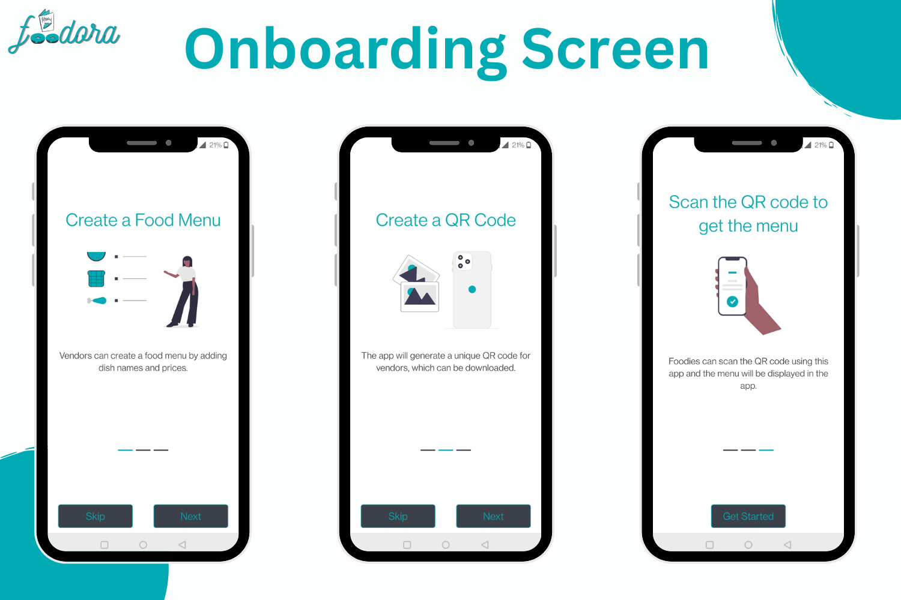
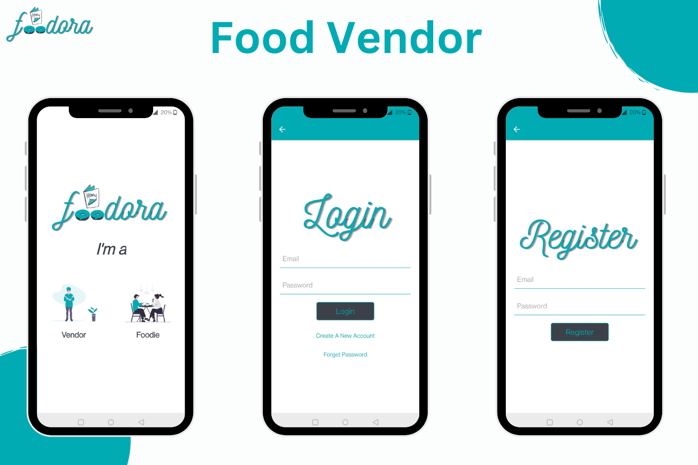
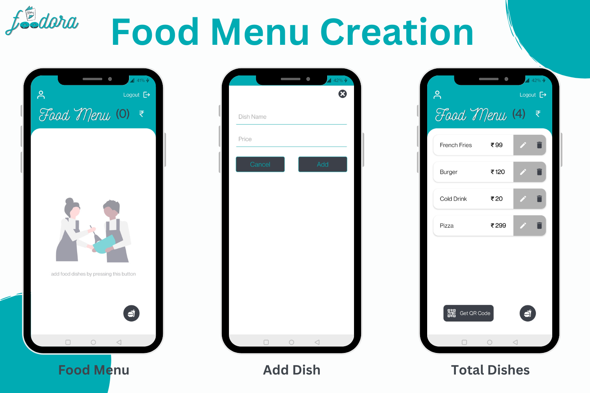
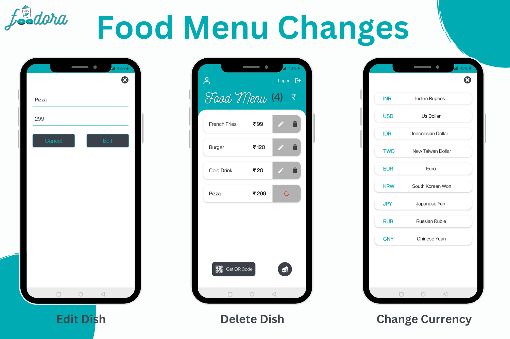
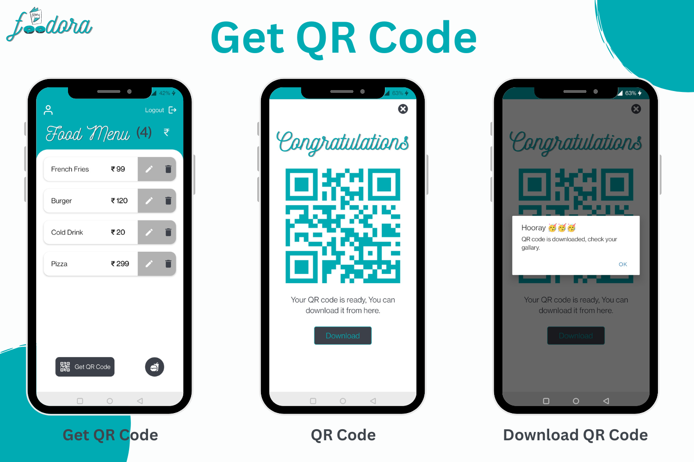
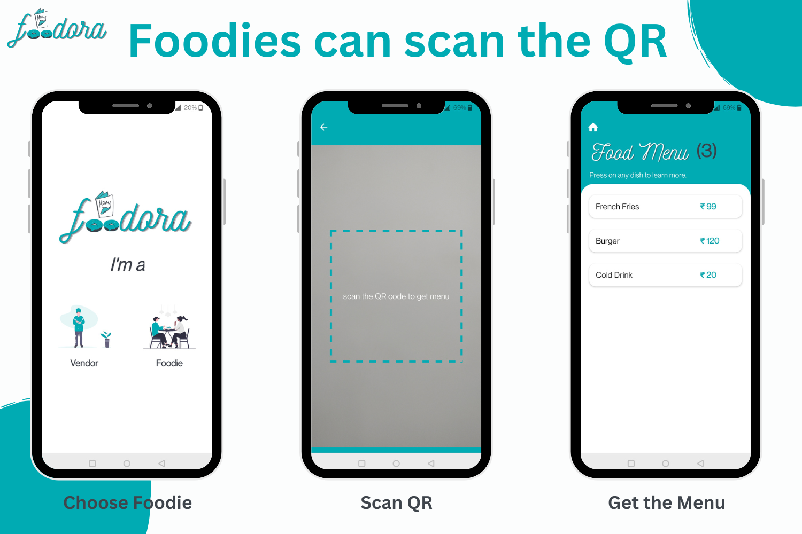
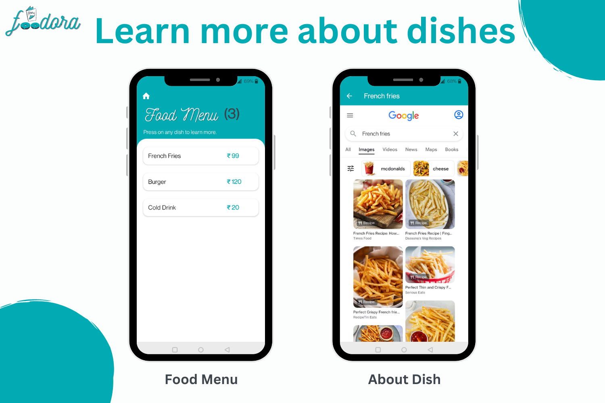

# Foodora

A digital food menu that vendors can create and get a QR code that can be scanned by foodies to get the menu on their smartphone.

## What inspired me

- One day, I went to a café where I finished my meal and received my bill. And everything was more expensive than what was listed on the menu. They said that while the menu had not been revised, the prices had.

- And this is how the concept for the Foodora app was created. I made the decision to solve every issue that physical food menus cause for consumers and business owners.

- Food vendors can digitally develop and edit their menus at any time with Foodora. A food service menu will be required regardless of the number of people who are present at any given time. Customers can all use their smartphones to scan the foodora QR code and get the menu.

## What I learned

- By completing this project, I gained knowledge about the entire creation process for an app. I learned how to approach a problem statement by gathering user requirements, creating the app's wireframes, and implementing the initial prototype.

- Additionally, I developed my ability to conceive on a whiteboard and construct easily translatable logic.

- I was able to sharpen my React Native mobile development skills and learn how to create small components and connect them together to create an app that is completely adaptable.

- The project taught me how to play with native smartphone APIs like the camera and media library to make something meaningful even though I had never used them before.

## How I built this project

- I initially grasped the problem statement before this thought ever entered my head. What issue am I addressing?

### I came up with these problem statements that I needed to solve

- At the moment, creating meal menus costs a lot of money for food providers.
- If new items are added to the menu or if any are removed, they must repeat the process.
- Because one cannot repeatedly print such pricey menus, price adjustments are exceedingly bothersome.
- No matter how many menus a street seller maintains on hand, it will never be enough to serve everyone waiting in line.
- After the pandemic, touching food menus that have been touched by people before us is not hygienic.

### After analysing the problem statement, I came up with solutions

- On mobile smartphones, food providers can download the Foodora app. Additionally, they are free to add any menu items they desire at the price they choose.
- After that, a QR code can be created with the simple push of a button. Only one copy of this QR code needs to be printed, and it should be left at the vendor booth or eatery.
- The menu will then be displayed on users' screens after they scan this QR code using the same app.
- Food items on the menu can be added, updated, and removed by vendors at any time and a limitless number of times. And the QR code does not need to be generated once more. Foodies will always receive the most recent version of the menu because it is updated automatically.
- It becomes a lot more enjoyable experience.

## Challenges I faced

- It took me 5 days to develop a wireframe of the app that is simple to understand because I wanted to make this app user-friendly so that neither the vendors nor the foodies need to be told what to do.

- Being a React native developer, getting started with it was not tough for me. But since I had never worked with the smartphone's camera and media library api before, I ran into my second roadblock when I began integrating them. I was able to incorporate it into my project after spending hours reading the documentation and replies on stackoverflow.

- The last difficulty was to tie everything together and produce a cohesive experience. Make a workflow for your app that runs well. I read my own code for hours while seated in my chair to optimise it.

## Built with

- React Native
- Javascript
- React Navigation
- Firbase
- goqr api
- expo-media-library
- expo-barcode-scanner

## Screenshots

